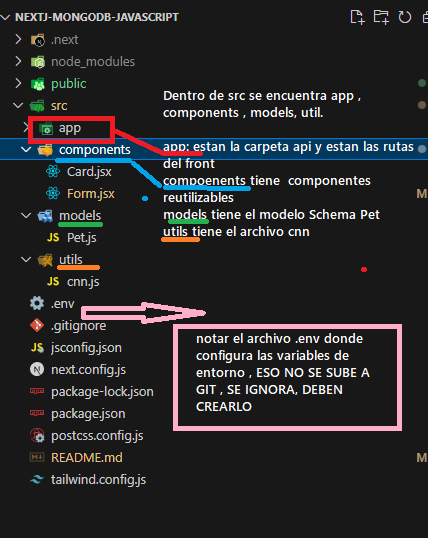
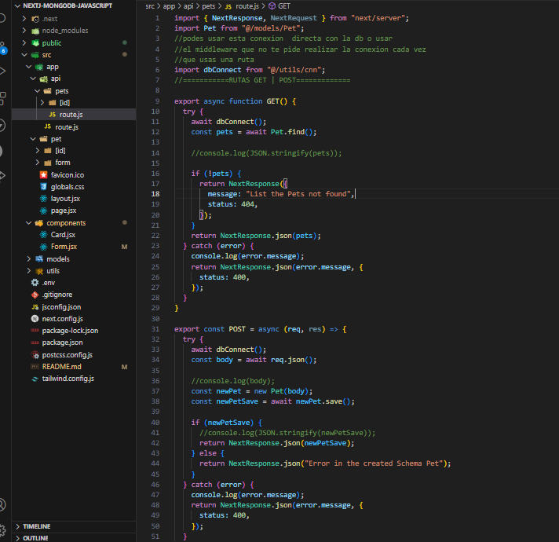
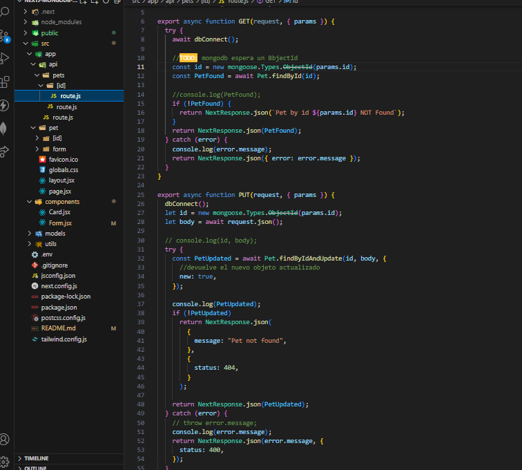
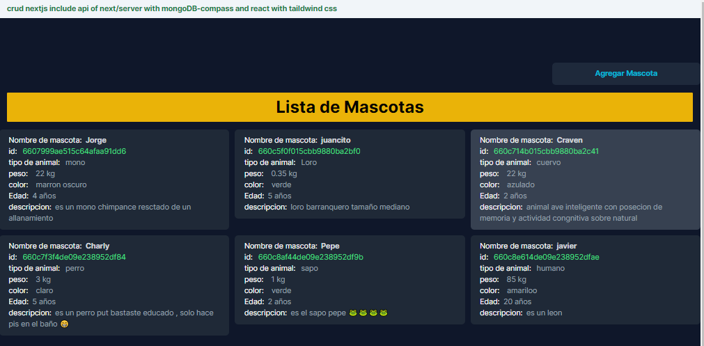
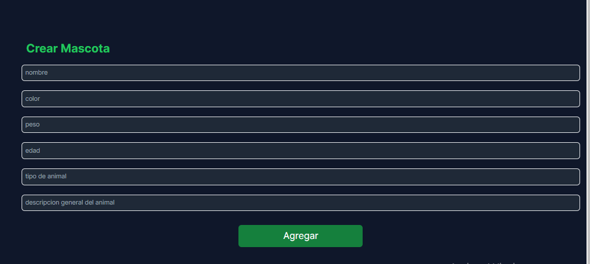
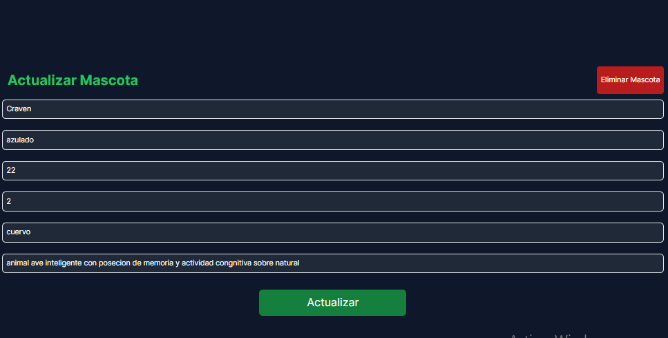
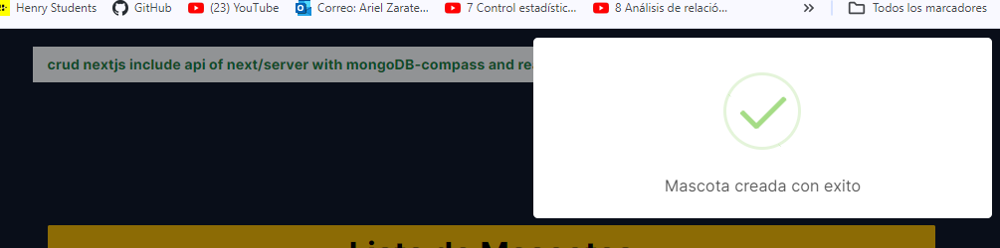
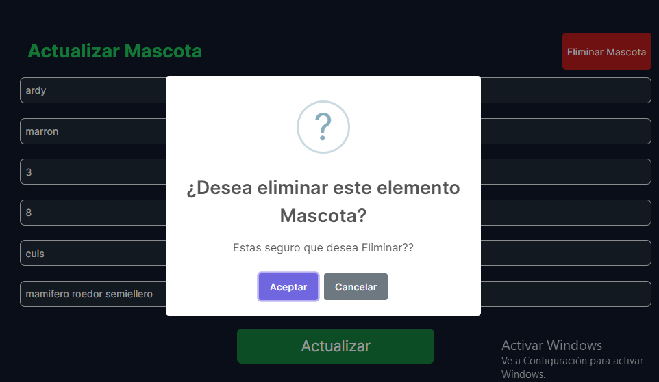

# PROYECTO FULLSTACK CON NEXTJS Y MONGODB CRUD DE MASCOTAS (PET)

Este es un proyecto que desarrollé para resolver las dudas de como usar `NextJs` utilizando la `[API]` brindada por nextjs con una bd No relacional como `[mongoDB]` y ademas ver su conexion a traves de `[mongoose]`. Permite a los usuarios realizar un Operaciones de `[C:create -R:read -U:update -D:delete ]`, de mascotas.
La conexion a la bd perimite tanto una conexion con `[Mongo-Compas(local/pc) o Mongo- Atlas(nube)`, solo deberian cambiar la uri.
Y para el manejo de CSS usamos el framework `[Taildwind css]`
Como nextJs está diseñado para ser [rápido, eficiente, fácil de usar,no necesita instalar casi ninguna dependencias ] y puede ser útil para `[quienen deseean un proyecto modelo completo con la vista de la API usando NextReponse/NextRequest]`.

!Debo decir que con nextjs soy nuevo aun usandolo llevo un año y me ha parecido una buena opcion de React este framework ya que facilita muchas caracteristicas que en reactjs debiamos instalar por nuestra cuenta
NextJs tiene:

- SSR (server side render): renderizado del lado del servidor
- Generación de sitios estáticos (SSG): prmite la generacion de paginas precompiladas en tiempo de ejecucion
- Router File System:Enrutamiento basado en archivos
- API de datos estática y dinámica:getServerSideProps() y getStaticProps()
- Pre-procesamiento de CSS:menaja varios tipos de procesamiento como CSS module , CSS global ,CSS en linea ademas de Sass y otros
- Optimización de imágenes

#### NOTA

mas adelante tengo pensado mejorar este proyecto con un login,
por ahora solo es un crud con su api y su front en nextjs y mongoDB , lo que corresponderia a la pila de tecnologia MERN.
Tambien podria agregarle manejador de estados (Redux).
Y el front podria mejorarse muchisimo con muchos mas componentes y mejor estilizacion, aclaro esto porque la idea es solo mostrar el crud no darle mucha inportancia al front en si en lo visual.

## Descarga del proyecto.

- git clone https://github.com/arielZarate/nextj-mongoDB-javascript.git

## Inicializar proyecto

Primero , debes corren el proyecto

```
1. npm install
2. npm run dev

abre [http://localhost:3000]  en el navegador

```

## Estructura del proyecto

#### vista completa de todo

<div>
  
  
  
</div>

## Rutas API

Podes acceder a las rutas de la Api mendiante navegador a las `[GET]` o con `POSTMAN`(servicio rest) , a todas las rutas `GET-POST-DELETE-PUT`

#### url

URI:`[http:localhost:3000]`

- Ruta bienvenida `http:localhost:3000/api`
- Ruta POST `http://localhost:3000/api/pets` , debes mandar un body/json ,ojo!!
- Ruta PUT `http://localhost:3000/api/pets/6607999ae515c64afaa91dd6` debe proporcionar un id
- Ruta DELETE `http://localhost:3000/api/pets/6607999ae515c64afaa91dd6` debe proporcionar un id
- Ruta GET `http://localhost:3000/api/pets` trae todas las mascotas (pets)
- Ruta GET BY ID `http://localhost:3000/api/pets/6607999ae515c64afaa91dd6` (el id es un ObjectId de mongo db)

* IMAGEN DE LA API PETS
  

- IMAGEN DE LA API PET/[ID]
  

## MongoDB

```bash
- Aclaro esto para que no haya dudas , si esta usando mongoCompas en tu pc debes levantar el servidor o asegurarte que este levantado sino en mongoAtlas debes loguearte y conectar
- Debes abrir un cmd y escribir el comando para levantar el server `mongod.exe` , si tienes todo configurado en tu variables de entorno y te renonoce el comnado se ejecutara .


```

## Front End (react)

cuando se ejecuta el `http://localhost:3000` se inicia la web y se muestra la lista de mascotas

- pueden hacer click en alguna mascota y lo llevara a un Form
- En el Formualrio pueden crear , editar o eliminar la misma mascota



#

#



#

#



## Dependencias

```bash
npm i mongoose
npm i sweetAlert2

```

- mongoose es una librearia para poder crear los schemas y la conexion con mongodb
- ademas mongoose permite validar los datos de entrada en el backend
- sweetalert2 es una librearia para poder Noticaciones mas bonitas , es de javascript

### funcion showNotification

cree una funcion generica que sirve para poder mostrar las notificaciones

```bash
Esta función showNotification acepta los siguientes parámetros:

type: puede ser 'success', 'warning', 'error' o cualquier o 'info
message: El mensaje que se mostrará en la notificación.
duration: La duración en milisegundos que la notificación estará visible. Por defecto, es 3000 ms (3 segundos).
position:  Puede ser 'top', 'top-start', 'top-end', 'center', 'center-start', 'center-end', 'bottom', 'bottom-start', o 'bottom-end'. Por defecto, es 'top-end'.


export const showNotification = (
  type,
  message,
  duration = 3000,
  position = "top-end"
) => {
  let icon = "";
  switch (type) {
    case "success":
      icon = "success";
      break;
    case "warning":
      icon = "warning";
      break;
    case "error":
      icon = "error";
      break;
    default:
      icon = "info";
  }

  Swal.fire({
    icon,
    text: message,
    position,
    showConfirmButton: false,
    timer: duration,
  });
};

```

y tambien una funciona para la confirmacion simulando window.confirm

```bash


//funcion para la confirmacion de algo , si pone aceptar o cancelar ejecutar lo que desida en el mensaje
export const showConfirmation = async (
  title = "Confirmación",
  text = "¿Estás seguro?",
  icon = "question",
  confirmButtonText = "Aceptar",
  cancelButtonText = "Cancelar"
) => {
  // la confrmacion me retorna un true o false
  // si es true yo se que debo eliminar
  return new Promise((resolve) => {
    // Crear una nueva promesa
    Swal.fire({
      title, // Título del cuadro de diálogo de confirmación
      text, // Mensaje de confirmación que se muestra debajo del título
      icon, // Ícono que se muestra junto al título (puede ser 'warning', 'error', 'success', 'info' o 'question')
      showCancelButton: true, // Indica si se debe mostrar el botón de cancelar (true para mostrar, false para ocultar)
      confirmButtonText, // Texto del botón de confirmación (normalmente es el botón 'Aceptar')
      cancelButtonText, // Texto del botón de cancelación (normalmente es el botón 'Cancelar')
    }).then((result) => {
      if (result.isConfirmed) {
        resolve(true); // Resuelve la promesa si el usuario confirma la notificación
      } else {
        resolve(false); // Resuelve la promesa si el usuario cancela la notificación
      }
    });
  });
};

```



##


